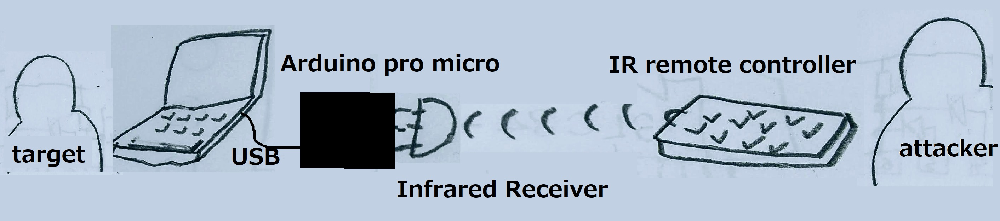
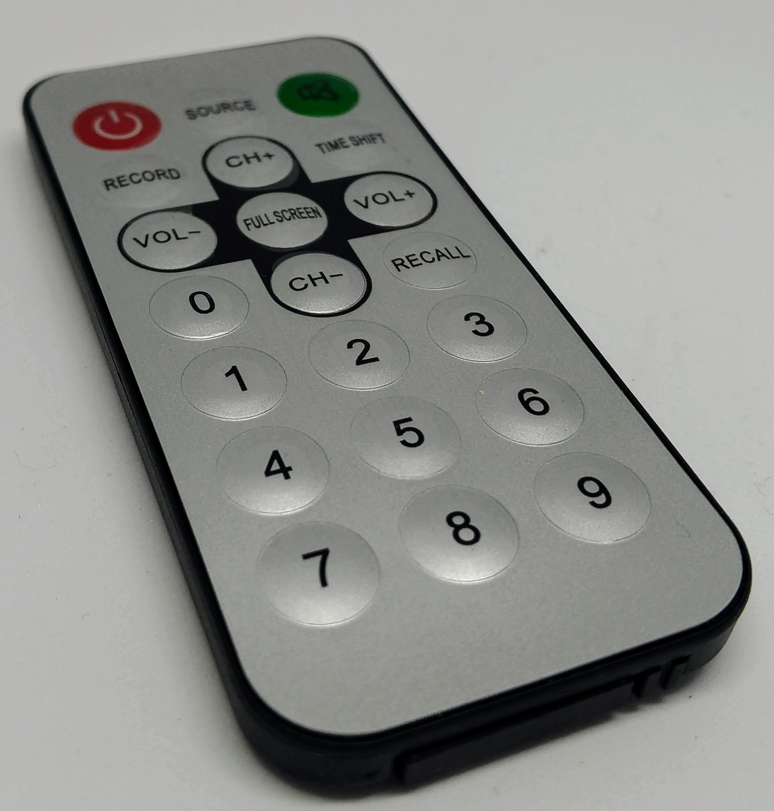
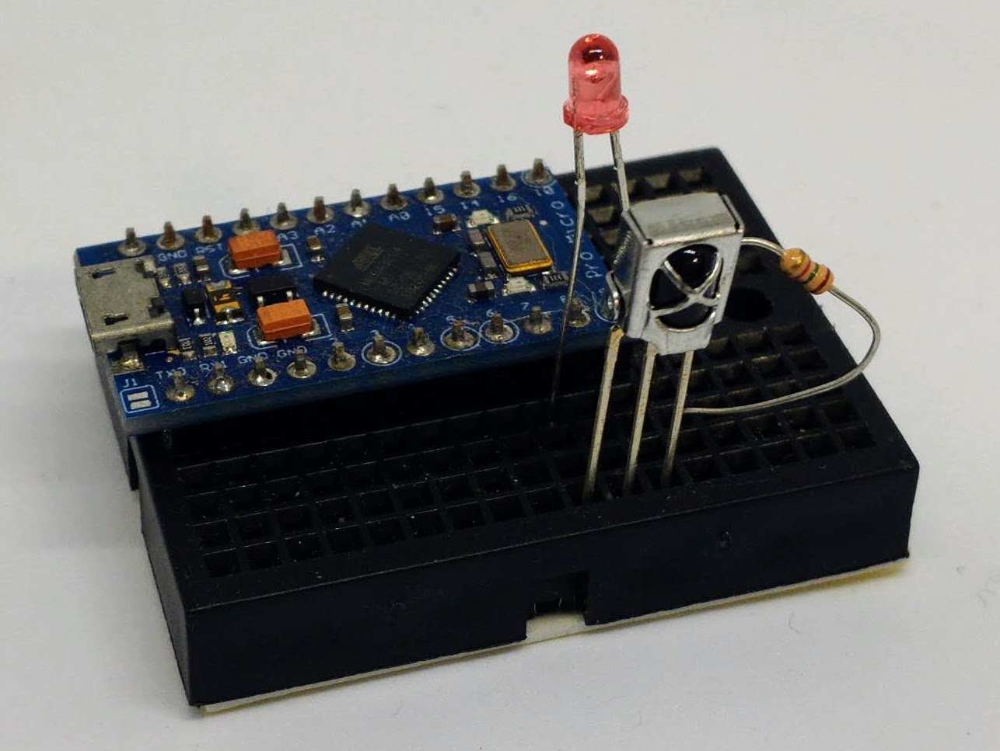
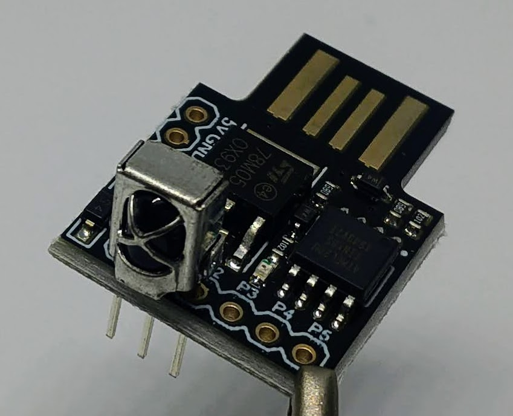
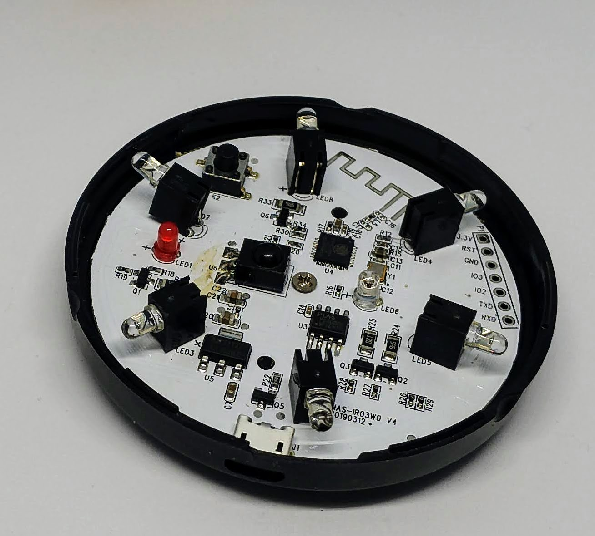
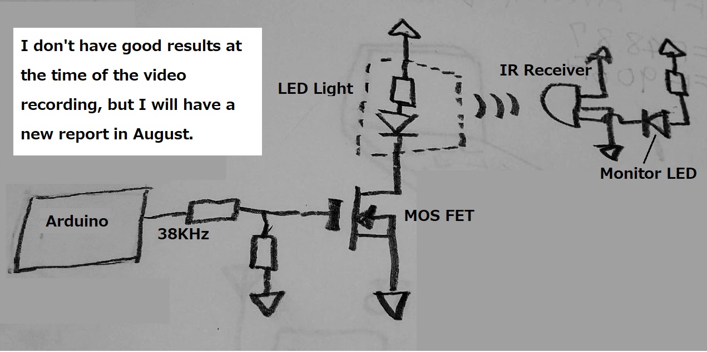
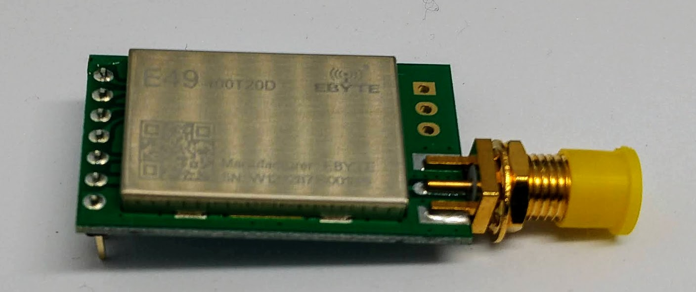
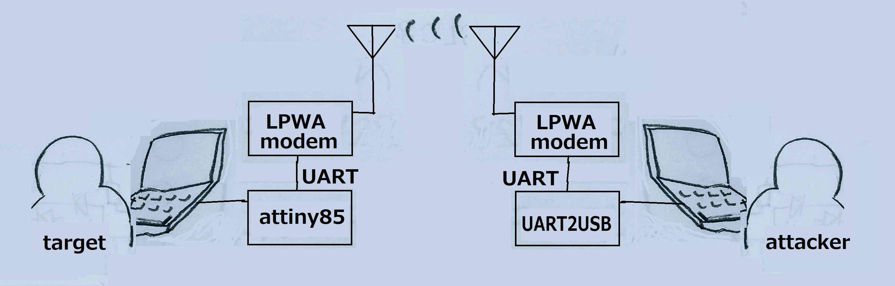
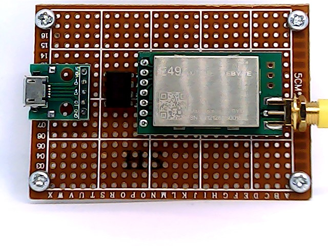
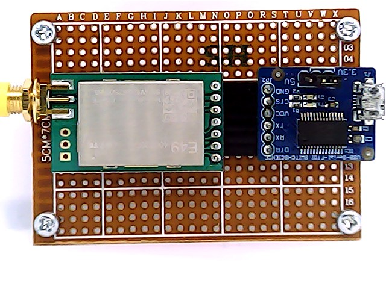

# IR(Inreared) BadUSB attack 

---
## Bio

Michihiro Imaoka is a founder of Imaoca Engineering Office in Japan. He is also an FPGA developer, an embedded system developer, and a technical writer. He has been a Microsoft MVP since 2014 (Windows development), Black Hat USA Arsenal presenter in 2020 and 2021.

---
## Overview
Conventional BadUSB executes a pre-programmed key sequence upon insertion.
This lecture reports a new vulnerability that arises from the addition of an IR receiver element to the traditional BadUSB.
The addition of this element allows an external operator to execute key sequences at arbitrary times. Multiple pre-programmed key sequences can be selected at will by external operation.
IR-BadUSB is operated using an IR remote control device for general household appliances.
However, the target and the attacker must be within IR range of the IR remote control device. Combined with WiFi smart devices, attacks can be launched from outside the target's office.

---

## ir remote components

---
### Infrared Receiver VS1838B

Working Voltage is  2.7V to 5.5V.
Reception Angle is ± 35 Degree.
Carrier frequency is 38KHz.
From the left pin, the order is Signal, GND, and VCC.

---
### IR remote controller

It is ordinary home remote control device.Infrared rays with wavelengths between 940 nm and 950 nm are used in remote control devices for home use. This controller sends out infrared ray according to the "NEC Infraed Transmission Protocol".

---

### NEC Infrared Transmission Protocol

This protocol is one of the most popular methods of infrared remote control. Infrared wavelength of 950nm is used. It uses 38 KHz as a subcarrier. 32 bits are transferred in one frame. 1 frame transfer time is 67.5 ms.

---

## Arduino pro micro

This is the microcontroller used in this experiment, which operates as IR-BadUSB when connected to a PC via USB.

~~~
Memory Clock Speed	16 MHz
GPU Clock Speed	16 MHz
ATMega 32U4 running at 5V/16MHz
~~~
The microcontroller has a built-in USB function and operates as a HID (Human Interface Device ) such as a PC keyboard.
The program is developed using ArduinoIDE.

---

## source code setup()

~~~
#include <IRremote.h>
#include "Keyboard.h"
int recvPin = 7;
IRrecv irrecv(recvPin);
void  setup ( )
{
  irrecv.enableIRIn(); 
  pinMode(8,OUTPUT);
  pinMode(9,OUTPUT);
  digitalWrite(9,HIGH);
  Keyboard.begin();
}
~~~
Use IRremote and Keyboard libraries.
IRremote is a library that codes infrared signals, and Keyboard is a library that allows this microcontroller to act as a PC keyboard.
The setup function is executed only once at startup.Set GPIO to provide positive voltage and ground to the IR receiver signal pins and the IR receiver VCC and GND pins.

---
## source code loop()

~~~
void  loop ( )
{
  decode_results  results;       

  if (irrecv.decode(&results)) { 
      if (results.value==0xFF48B7)
          Keyboard.println("Hello IRBadUSB! #0");
      if (results.value==0xFF906F)
          Keyboard.println("Hello IRBadUSB! #1");
      irrecv.resume();            
  }
}
~~~
The loop function is executed repeatedly after the Setup function is executed.When the IR receiver receives 0xFF48B7, it sends the key sequence "Hello IRBadUSB! #0" to PC as keyboard.If 0xFF906F is received, the key sequence is "Hello IRBadUSB! #1".This corresponds to the 0 and 1 keys on the IR remote control device.

---

## Digispark Attiny 85

An even smaller microcontroller (Attiny85), as shown in the photo, could be used to integrate it into a USB dongle.
The Leonardo USB ATMEGA32U4 mini development board, like Digispark, is also small and can be directly inserted into a PC's USB port, so it can be integrated into a dongle.

---

## WiFi Smart Device

This device bridges WiFi and IR communications. The photo shows its interior. ESP32 is used as the processor.
Placing a this device (AP Mode) in the target office poses a threat to remote control of the IR-BadUSB from outside the office, such as from a mobile device.

---
## LED Lights

We have tried infrared camera floodlights to extend the reach of the infrared ray.

- 48 IR LEDs
- Use with night vision camera
- IR LED Wavelength: 940nm
- Visual range: 5-10 meters
- Adapter power supply: DC 12 V

---
## Experiments on IR reach with IR light

---

## LPWA (Low Power, Wide Area)

We have been talking about IR Badusb, and now we would like to talk about a further threat. That is the threat when Badusb and LPWA work together. This is LPWA module. The transfer rate is slow, but the reach is several kilometers or more.

---
## LPWA attack diagram

attiny 85 as HID.

---

## components on the target side

- USB connector
- Attiny 85 as HID
- LAPW modem

This component connects to the target PC via USB. The target PC is recognized as HID. It behaves as a keyboard on the target PC.

---

## components on the attack side

---
## Conclusion
- We reported on the new threats posed by BadUSB and IR receivers working together.
- The IR-BadUSB realization method was explained.
- BadUSB suggested that working with LPWA poses more of a threat than IR.
